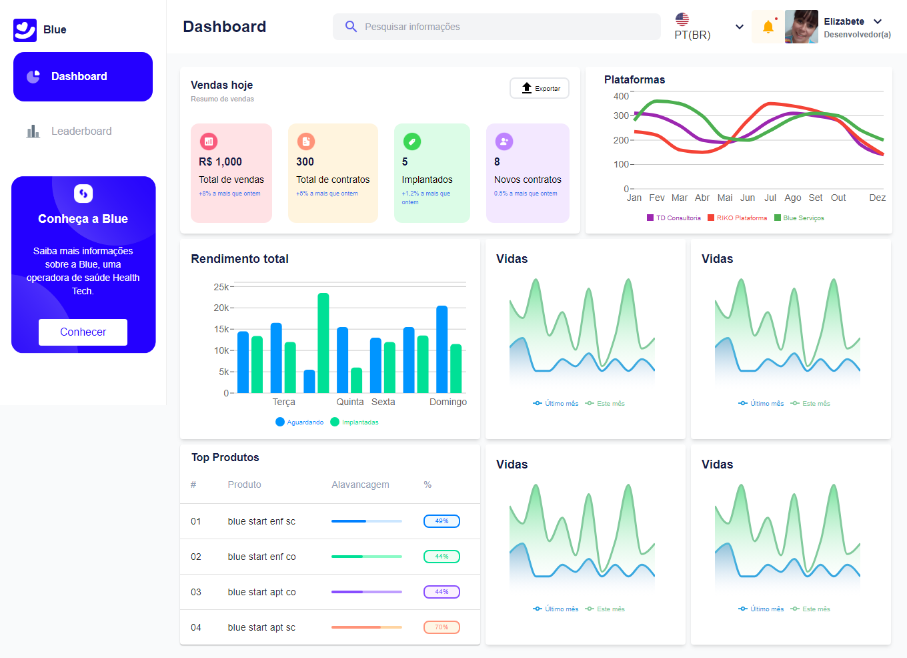

<h1>
    
    Blue Challenge
</h1>

## 🚀 Tecnologias Utilizadas

- [ViteJs](https://vitejs.dev/) - Ferramenta de construção moderna que fornece uma experiência de desenvolvimento mais rápida.
- [TailwindCSS](https://tailwindcss.com/) - Framework CSS para design rápido e responsivo.

## 📘 Guia de Instalação e Desenvolvimento

<table>
  <thead>
    <tr align="left">
      <th>Nº</th>
      <th>Status</th>
      <th>Etapas</th>
      <th>Instalação Desenvolvimento do Projeto</th>
    </tr>
  </thead>
  <tbody align="left">
    <tr>
      <td>01</td>
      <td></td>
      <td>Configuração do projeto</td>
      <td align="center">
        
      </td>
    </tr>
    </tbody>
  <tfoot>
  </tfoot>
</table>

## 💻 Página Home

 

##### Desenvolvido por Elizabete Fabri ❤

